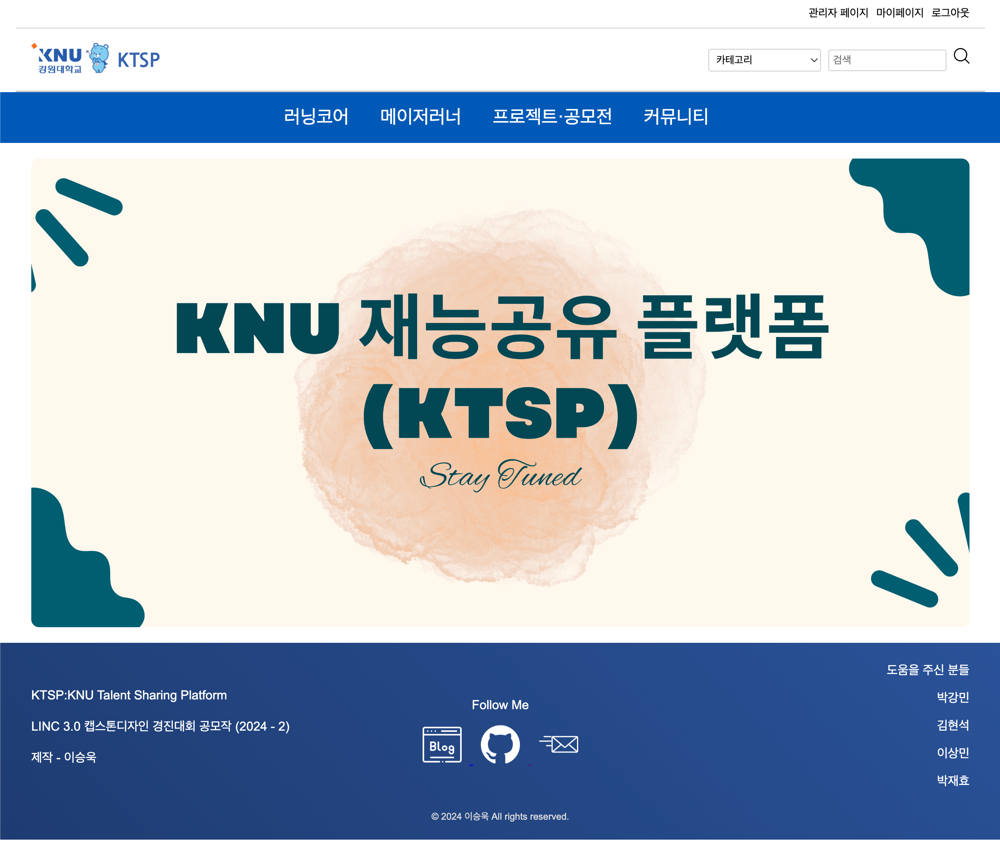
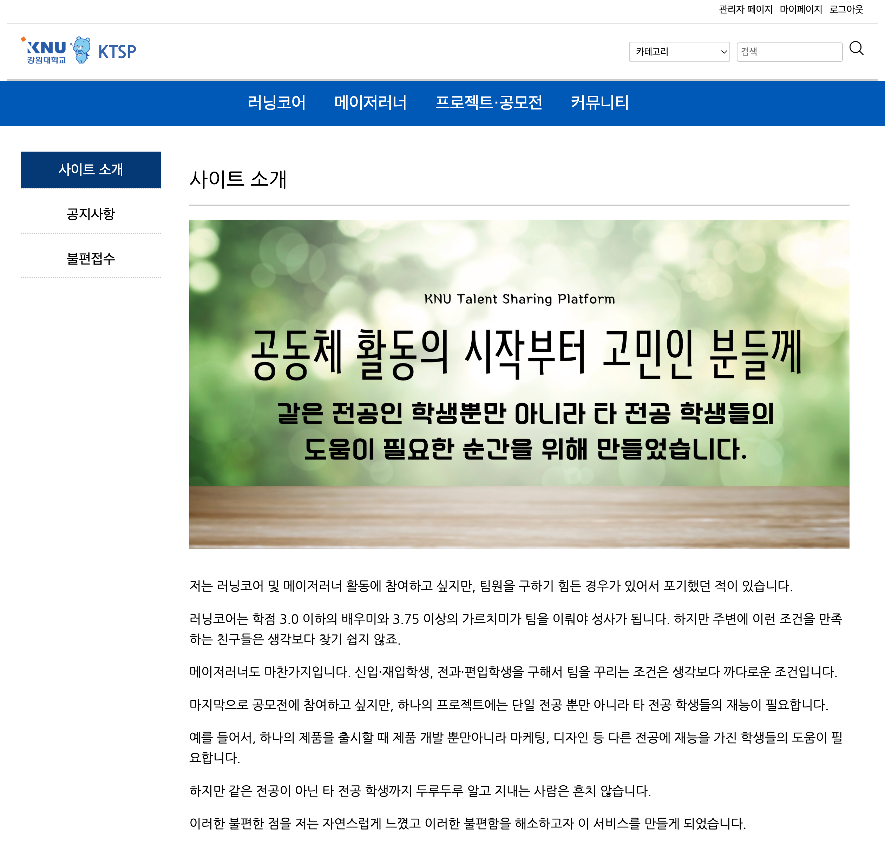
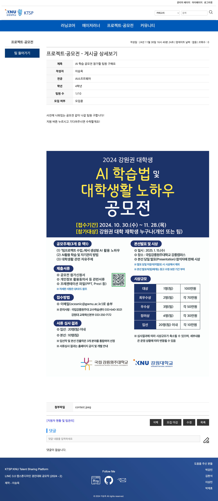
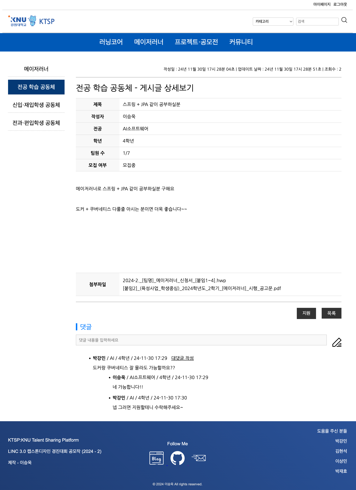
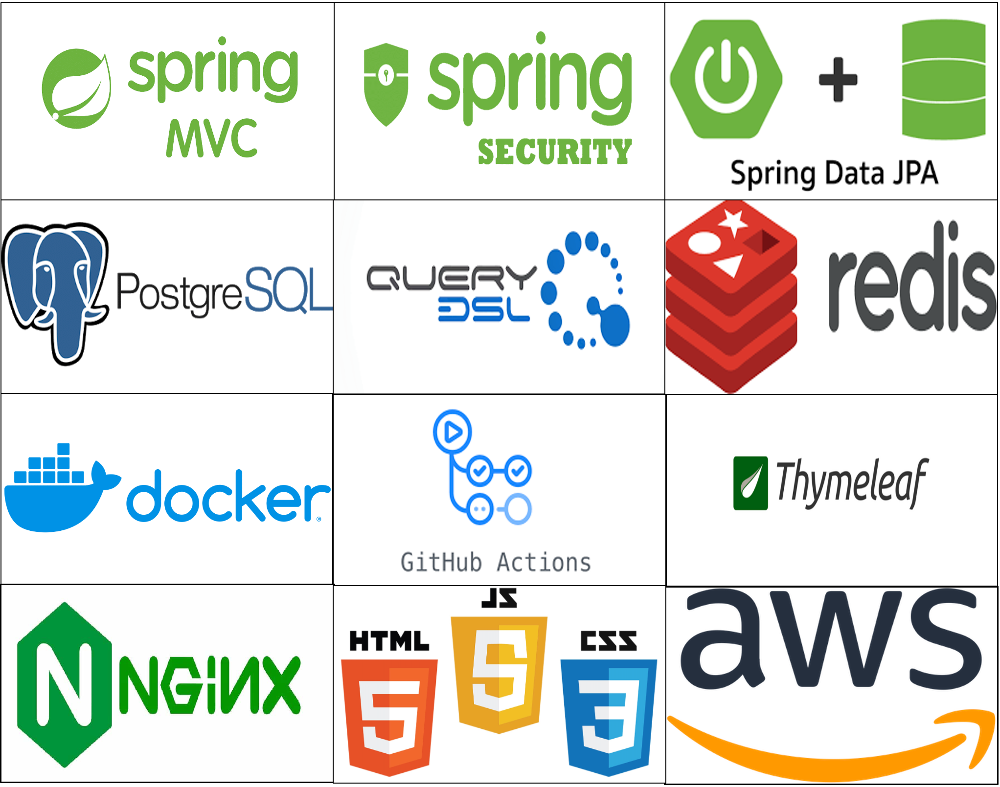

# KTSP:KNU Talent Sharing Platform
## linc 3.0 강원대학교 캡스톤디자인 경진대회 금상 수상작(2024 - 2)

## Introduction

- 강원대학교 학생들이 프로젝트나 공모전에 참여할 때 팀원을 구하는 과정에서 겪는 어려움을 해소하기 위한 팀 빌딩 플랫폼
- 교내 학습 지원 프로그램인 러닝코어 및 메이저러너의 팀원을 구하기 어려운 학생들을 위한 팀 매칭 플랫폼

> [!TIP]
>
> 개인적으로 공모전이나 프로젝트를 참가하고 싶지만 하나의 제품 또는 서비스는 단일 전공의 학생들로 완성시키기 힘들다고 생각하였다.
>
> 그래서 같은 전공의 학생들끼리 팀을 구성하는 것이 아닌 교내의 다양한 학과의 학생들끼리 필요한 재능을 "공유" 하면 훨씬 더 좋은 결과가 있을 것이라고 생각하여서 이 서비스를 만들게 되었다.

## Design

### **홈 화면**

 

### **사이트 소개 화면**

 

**게시글 상세 화면**

 

## 기술 스택

 

## 아키텍쳐

